Using the program
=================

General description
-------------------

**cleanest** was inspired by ``CLEAN`` and ``BCLEAN``, the interactive and
automatic, respectively, cosmic ray removal commands belonging to the Starlink
general-purpose data reduction package `FIGARO <http://ascl.net/1411.022>`_.
The need for a program like **cleanest** arose after realizing that cosmic ray
cleaning could be improved by merging the capabilities of interactive and
automatic cosmic ray detection and removal in a single application.

The search of cosmic rays is based on the idea of looking for pixels with a
unexpectedly high signal. For this purpose, the program searches for selected
pixels of the frame, comparing its value with the mean of the neighbour
pixels (those within what is called the *searching square*). In this
statistic, pixels in the same row and column of the pixel under study are
not taken into account (if a pixel has been affected a cosmic ray, it is more
likely that its closest pixels have also been affected by the same cosmic ray).
 
Three initial searching criteria are available:

- ``SIGCR``: the signal in the pixel must exceed the mean value by ``SIGCR``
  times the r.m.s. in the searching square.

- ``MINVCR``: the signal in the pixel must exceed the mean value by ``MINVCR``.

- ``FACTCR``: the signal in the pixel must exceed the mean value by FACTCR 
  times the mean value.
 
The user can establish any combination of the three searching criteria (note
that if more than one criterium is currently in use, a cosmic ray will be found
if the considered pixel verifies any of the activated criteria).
 
Once a pixel has been detected as suspicious of being affected by a cosmic ray,
the program proceeds with a more sophisticated analysis. In this additional
step, a new size of the searching square is defined. The pixels in the new
searching square are sorted by increasing signal, computing new mean and r.m.s.
values using exclusively those pixels with signal comprised in the range
``[PERCENTILE1,PERCENTILE2]``. Both percentile limits can be modified by the
user.  In this way, pixels with a very high signal (cosmic rays, sky lines), as
well as pixels with too low signal (cool and dead pixels), can be removed from
the statistic. After this point, cosmic rays are searched by using a new
``SIGCR`` criterium called ``SIGTHRESHOLD`` (no matter what the initial
criteria were), starting by the suspicious pixel and then looking over the
eight pixels which surround it. If any of the neighbour pixels is found to be a
cosmic ray, the search continues until no more cosmic rays are found in the
neighbourhood of an already found cosmic ray. With this strategy, all the
pixels affected by a single cosmic ray hit are connected among themselves
(i.e., each one is connected to at least another pixel also affected by cosmic
ray).

Once all the suspiciuos pixels have been detected, their signal is replaced by
interpolated values, using for that purpose neighbour pixels not affected by
cosmic ray.

The presence of spectral features complicates the search for cosmic rays. For
that reason **cleanest** incorporates additional options which help to remove
cosmic rays in long-slit spectroscopic images:
 
- Before computing the mean and r.m.s. in the searching square, the averaged
  spatial and wavelength profiles can be subtracted, which highlights cosmic
  ray pixels with respect to the background signal.
 
- Similar images (to that being cleaned) can be loaded at running time,
  allowing for a dynamical comparison of image regions, which helps to
  discriminate doubtful pixels (e.g. hot pixels versus cosmic rays).

Execution example
-----------------

After installing the program, you can run **cleanest** by executing:

::

   $ cleanest

The following examples have been generated using the sample FITS image
:download:`wht070.fits <download/wht070.fits>` (a 1800 s exposure dark frame
obtained with the ISIS spectrograph at the 4.2m William Herschel Telescope, El
Roque de Los Muchachos Observatory, La Palma, Spain, on December 18, 1995).

::

   *****************************************
       Welcome to cleanest (version 5.0)
   -----------------------------------------
   > See documentation in:
   http://cleanest.readthedocs.io/
   *****************************************
   
   >>> INTRODUCE INPUT DATA FRAME:
   Input FITS file [*.*fit*] ? wht070.fits

The first step is to indicate the name of the FITS file containing the image to
be cleaned. Since the program accepts wildcars, hitting ``RETURN`` provides a
list with the existing files at the current directory matching the specified
input.

Note that most of the input questions that appear while executing **cleanest**
typically have default values, indicated between square brackets.

::

   CFITSIO> BITPIX:           16
   CFITSIO> NAXIS1:         1124
   CFITSIO> NAXIS2:          226
   CFITSIO> OBJECT: DARK
   
   Work with error images (y/n) [n] ?

An associated error image (containing the expected r.m.s. at each pixel) can
also be interpolated (applying the same interpolation options adopted in the
original image). Note that using this option leads to error correlation! In
this simple example we are not using it.

::

   * DEFAULT OPTIONS:
   SIGCR = 5.0
   SIGTHRESHOLD = 6.0
   FACTCR (not employed)
   MINVCR (not employed)
   SIGCRAUX = 10.0
   Do remove mean x/y direction before looking for C.R.
   Edge size of the Searching Square: 15 pixels
   Plot type 1
   Highlight pixels with mininum and maximum values
   FG and BG do not fixed
   
   Accept default options (y/n) [y] ?

Default options are shown. The user here can decide whether to modify them or
continue.

::

   Are you using graphic buttons.....(y/n) [y] ? 
   Graphic device #1 (? to see list) [/XServe] ? 
   Graphic device #2 (NONE=EXIT) (? to see list) [NONE] ? 
   >>> palette: heat
   
   ---------------------  MAIN MENU   --------------------------
   start.....- begin automatic detection of C.R. (clean by HAND)
   region....- examination of some pixel region
   window....- change edge size of displayed image region
   automatic.- clean automatically
   look......- have a look to the image
   options...- change searching options
   save......- save current image
   histogram1- create DATA histogram
   histogram2- create SIGMA histogram
   top1000...- search the top 1000 in SIGMA
   plotsp3d  - emulate plotsp3d program
   QUIT......- end of program
   -------------------------------------------------------------
    
   NOTE: remember that # reverses data!!!
 
After specifying the PGPLOT graphic device, the graphic window opens at the
main menu, which provides the options briefly explained in the terminal. Each
option is accesible through a graphic button that can be activated either by
clicking it with the mouse cursor or by pressing the key that appears between
brackets in the button label.

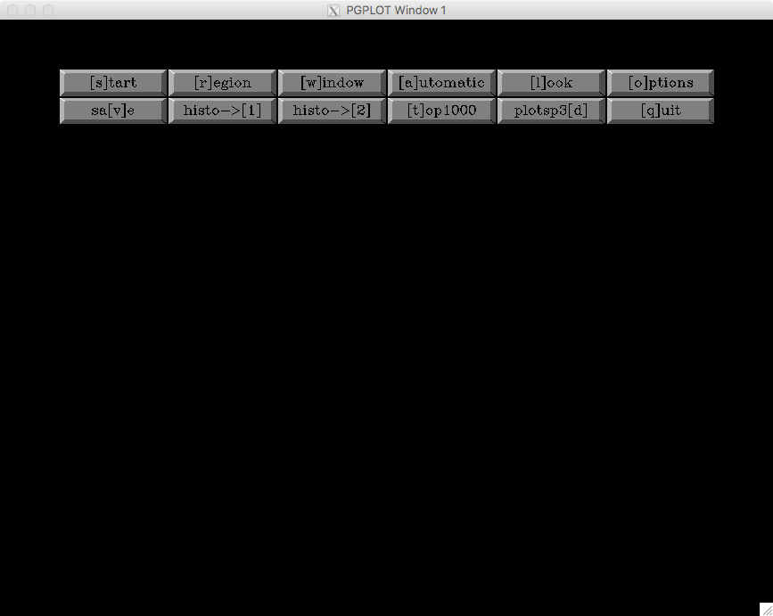

All these options are explained with more detail in the next subsections.

Option ``[l]ook`` in main menu
..............................

A reasonable way to start cleaning the cosmic rays consists in *having a look*
to the image. For that purpose, select the ``[l]ook`` button in the main menu.

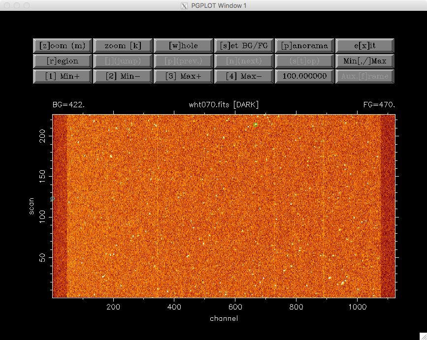

::

   >>> z1=    422.000000    
   >>> z2=    470.000000    
   Background:    422.000000    
   Foreground:    470.000000    
   > From Scan    #    1 to   226
   > From Channel #    1 to  1124
   > Total number of pixels:     254024
   > Maximum: 60591.0000  at (channel,scan):         666         214
   > Minimum: 388.000000  at (channel,scan):           1         123
   > Mean   :    450.532867    
   > Sigma  :    195.278564    

The whole image is displayed in the graphic window while some basic statistic
is displayed in the terminal. The pixels containing the maximum and mininum
image values are encircled with open green and cyan circles, respectively.

The new options available in this level are:

- ``[z]oom (m)``: select region to be zoomed with mouse

- ``zoom [k]``: select region to be zoomed with keyboard

- ``[w]hole``: replot whole image

- ``[s]et BG/FG``: set background and foreground levels

- ``[p]anorama``: allows to subdivide the image into smaller rectangular
  subregions, which can be displayed one after another (this option is useful
  to examine the image when its dimensions exceed the monitor resolution). When
  selecting this option, the following buttons are activated: ``[j](jump)``,
  ``[p](prev.)``, ``[n](next)``, and ``(s[t]op)`` (which otherwise remain
  deactivated). With these buttons the user can easily examine the image in
  small rectangular regions, moving from each region to the next or previous
  one, jump to any region, or stop the detailed examination process.

- ``e[x]it``: return to main menu

- ``[r]egion``: search for c.r. at a fixed location

- ``[j](jump)``, ``[p](prev.)``, ``[n](next)`` and ``(s[t]op)`` options, which 
  are only available for the panorama visualization (see option ``[p]anomara``
  above)

- ``Min[,/]Max``: set background and foreground to the mininum and and maximum
  values in the current displayed region. The keyboard option ``/`` set the
  limits using the Iraf zscale algorithm (designed to display the image values
  near the median image value).

- ``[1] Min+``, ``[2] Min-``, ``[3] Max+``, ``[4]Max-``: change background and
  foreground by steps (in this case, the step is ``100.000000``, but this
  number can be modified by pressing the corresponding button)

- ``Aux.[f]rame``: if auxiliary frames have been loaded, this button allows to
  blink the different images (after pressing this button, the user must
  repeatedly press the mouse left button to interchange the images; pressing
  the mouse right button stops the blinking process)

Pressing the mouse in the image near the pixel (537,127) allows the user to
clean the cosmic ray nearest to this location.

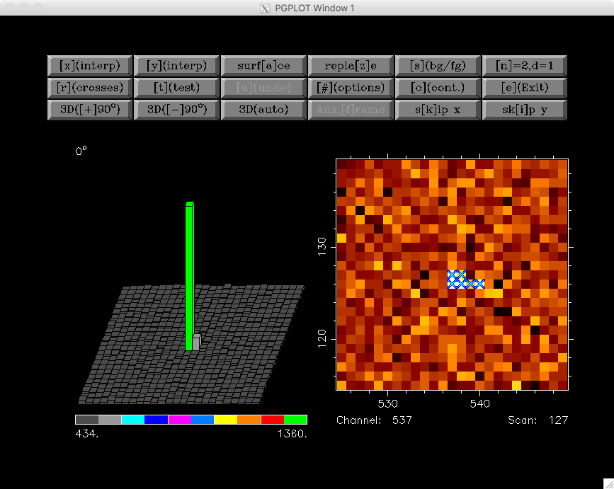

The pixels suspicious of being affected by a cosmic ray hit are preselected,
with a blue cross displayed over them, in the zoomed region shown on the right
panel. In addition, a pseudo 3D representation of the same
region is also displayed on the left panel.

The following new options are available at his level to study and remove the
pixels affected by the cosmic ray hit:

- ``[x](interp)``: interpolation in the x-direction

- ``[y](interp)``: interpolation in the y-direction

- ``surf[a]ce``: interpolation in both, x and y directions

- ``repla[z]e``: replace pixels by average of auxiliary frames (when available)

- ``[s](bg/fg)``: set background and foreground levels

- ``[n]=2,d=1``: number of pixels around the cosmic ray (at both sides in X, Y
  or both) to be employed to fit the polynomial, and polynomial degree. By
  default, the program starts with n=2 and d=1, which means that, in the case
  of an interpolation in the X-direction, the fit will be performed by using 2
  pixels on the left and 2 pixels on the right of the cosmic ray, and the
  polynomial will be a straight line.

- ``[r](crosses)``: remove crosses (preselected pixels suspicious of being
  affected by a cosmic ray hit)

- ``[t](test)``: compute statistic around the pixel selected by the user

- ``[u](undo)``: restore pixels to the values before
  entering into this program level

- ``[#](options)``: allow the user to change searching options

- ``[c](cont.)``: continue with next cosmic ray (or exit)

- ``[e]Exit``: exit from this program level

- ``3D[+]90`` or ``3D[-]90``: rotate the 3D image +-90 degrees

- ``3D(auto/fixed)``: set bg and fg limits in 3D plot to be computed
  automatically or fixed by the last plot

- ``Aux.[f]rame``: if auxiliary frames have been loaded, this option allows to
  blink the different images (after pressing this button, the user must
  repeatedly press the mouse left button to interchange the images; pressing
  the mouse right button stops the blinking process)

- ``s[k]ip x``: skip current central column in the following search (this
  option is removed just exiting from this program level)

- ``sk[i]p y``: skip current central row in the following search (this option
  is removed just exiting from this program level)

For example, using the ``surf[a]ce`` button in the current example leads to the
interpolation of the preselected pixels using a polynomial surface around those
pixels. The image representations around this regions are then updated, as shown
next.

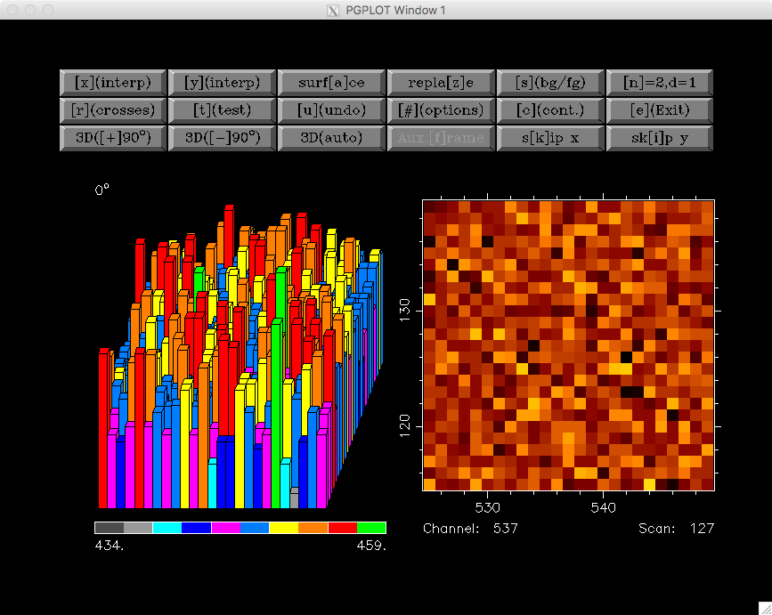

Pressing ``[c](cont.)`` or ``[e](Exit)`` at this point returns the user to the
previous ``[l]ook`` menu.

Option ``[s]tart`` in main menu
...............................

This is likely one of the most useful options of **cleanest**. Here the user
can rely on this program to search for the cosmic rays while transferring the
responsibility of the pixel interpolation to the user.

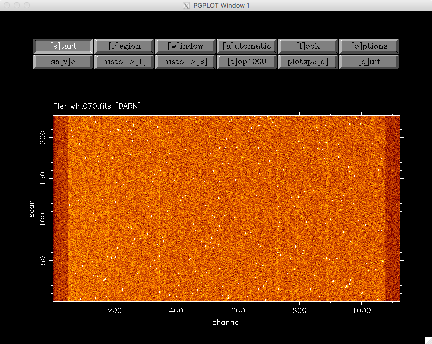

::

   >>> z1=    422.000000    
   >>> z2=    470.000000    
   (1) Change plot limits
   (2) Change BG/FG
   (3) Select plotted image and remove scans/channels with mouse
   (4) Select regions to be cleaned with keyboard
   (5) Select whole displayed image
   Option [5] ? 5
   Skip channels by keyboard (y/n) [n] ? 

The user can easily indicate the image region to be examined (in this example
the whole image). At this point **cleanest** starts searching for cosmic rays,
stopping after detection and leaving the user at the same program level
previously shown when selecting cosmic rays visually using ``[l]ook``.

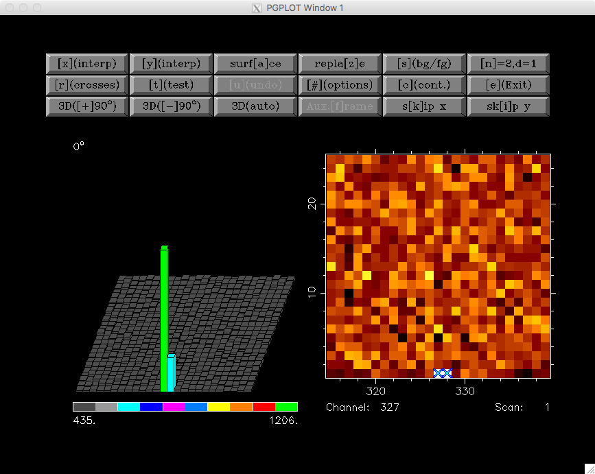

::

   C.R. FOUND AT   327      1
   Pixel value:    1206.00000    
   MEAN,SIGMA :    455.632660       4.16404819    
   SIGMA times over MEAN:    180.201401    

Again the user can modify the pixel preselection and decide which strategy to
follow in order to interpolate the selected pixels. Following the example, we
can interpolate using in this case ``[x](interp)`` (since the cosmic ray is at
the lower border of the image).

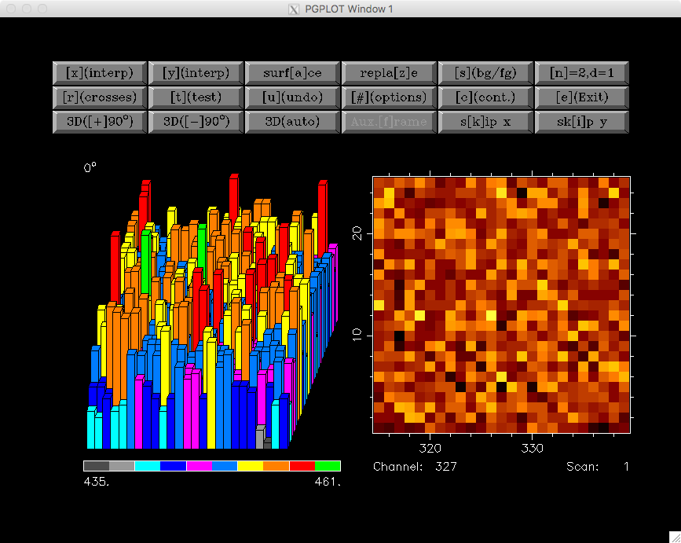

::

   Cleaning C.R. around pixel   327      1

After removing the cosmic ray, the user should decide whether to continue with
the automatic detection of cosmic rays, using the button ``[c](cont.)``, or to
stop the process and return to the main menu, using the button ``[e](Exit)``.

Option ``[r]egion`` in main menu
................................

In this case the program examines the image region around a particular pixel.
For example, we can examine the region around the pixel with coordinates 
(950,19):

::

   Channel, scan to go? 950,19

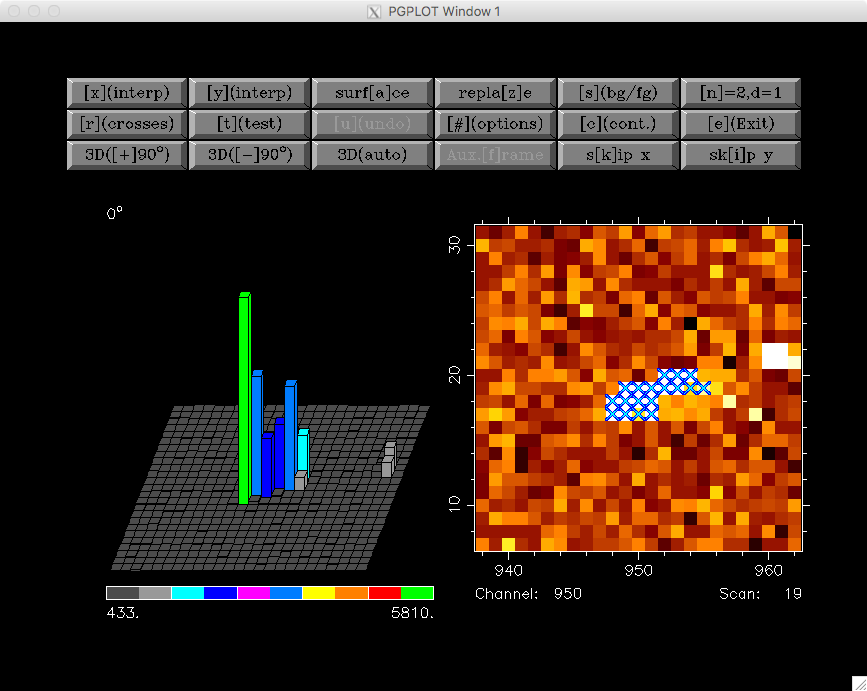

After removing the cosmic ray using ``surf[a]ce`` one gets:

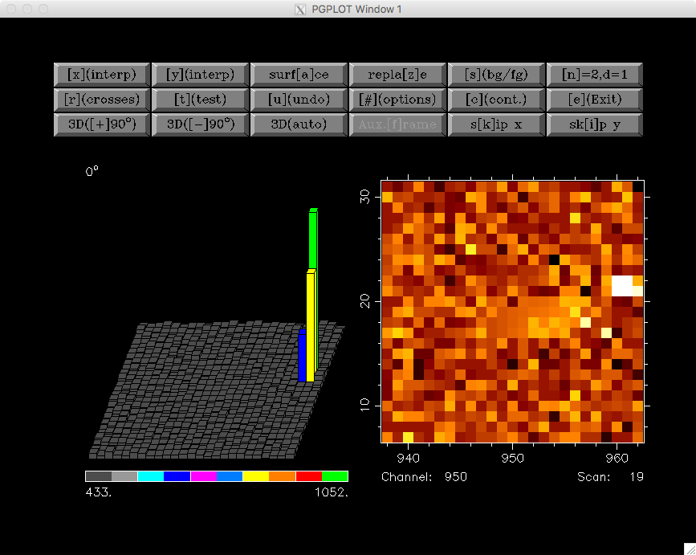

Note that in this case there is another cosmic ray still present in the same
image region. The user can continue cleaning it manually, selecting the
affected pixels with the help of the mouse, or leave this program level
selecting either ``[c](cont.)`` or ``[e](Exit)``.

Option ``[w]indow`` in main menu
................................

This option simply sets the edge size of the displayed image regions. Its
default value is 25 pixels, which is a good compromise when the cosmic ray hits
do not extend over large image regions.

::

   New size (this number must be odd) [25] ?

Option ``[a]utomatic`` in main window
.....................................

When the number of cosmic ray hits is large, and the user trusts the capability 
of **cleanest** to remove them automatically, this option comes very handy. It
is also useful to remove cosmic ray hits automatically in some regions of a
particular image, where there is no useful scientific information, leaving the
cleaning of the critical image regions for a more careful manual inspection.

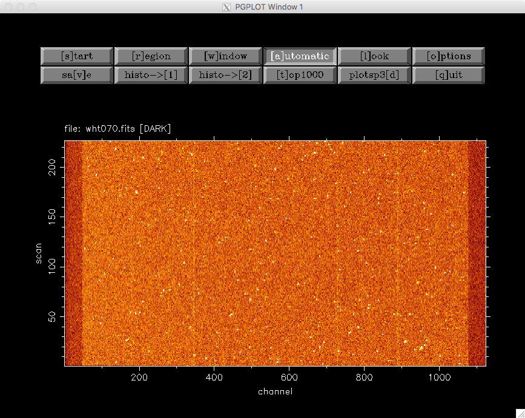

::

   >>> z1=    422.000000    
   >>> z2=    470.000000    
   (1) Change plot limits
   (2) Change BG/FG
   (3) Select plotted image and remove scans/channels with mouse
   (4) Select regions to be cleaned with keyboard
   (5) Select whole displayed image
   Option [5] ? 5
   Skip channels by keyboard (y/n) [n] ? n
   (1) X interpolation
   (2) Y interpolation
   (3) Polynomial surface
   (0) NONE (RETURN to main menu)
   Option  (0,...,4) [2] ?
   Plot individual c.r. (y/n) [n] ?
   Plot crosses over c.r. (y/n) [y] ?
   ...
   ...
   [DISPLAY OF INFORMATION CONCERNING THE AUTOMATIC DETECTION AND REMOVAL OF COSMIC RAYS]
   ...
   ...

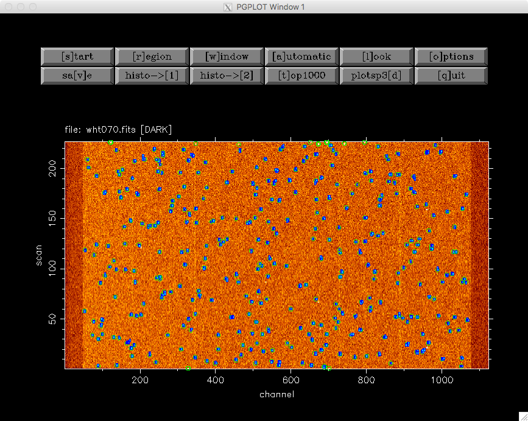

It is important to highlight that the selected interpolation method may not be
applicable for a particular cosmic ray hit. For instance, cosmic rays detected
at the image borders can be interpolated using only an interpolation method
that do not need to use information beyond the image limits. This is the reason
why in the previous example the cosmic ray hits found at the lower and upper
image borders have been detected but not interpolated (the selected
interpolation method has been ``(2) Y interpolation``).

In addition, since the detection of cosmic rays is carried out moving from one
row to the next one in increasing order, some *bright* cosmic rays may prevent
the detection of nearby cosmic rays located in lower rows (the *bright* cosmic
rays do fall in this case within the searching square of the *fainter* cosmic
ray). For that reason, this automatic process should be carried out at least
twice, or complemented by a manual inspection using the ``[s]tart`` method in
the main menu.

For illustration, the sample image used in this documentation has been
completely cleaned after executing the ``[a]utomatic`` detection twice (which
removes the bulk of the cosmic rays), and then running ``[s]tart`` (to clean
the cosmic rays located close to the image borders), with a total of 358 cosmic
ray hits removed. The cleaned image is shown next.

Option ``[o]ptions`` in main menu
.................................

The selection of this button in the main menu allows the user to visuallize and
modify important parameters concerning the detection and removal of cosmic rays
by **cleaning**.

::

   Are you employing SIGCR  (y/n) [y] ? 
   SIGCR [5.00000000] ? 
   Are you employing FACTCR (y/n) [n] ? 
   Are you employing MINVCR (y/n) [n] ? 
   Remove mean x/y direction before looking for the C.R. (y/n) [y] ? 
   [x],[y] direction or [b]oth (x/y/b) [b] ? 
   
   Edge size (pixels) of the Searching Square
   (Note: this number must be odd and .ge. 5) [15] ? 
   SIGTHRESHOLD [6.00000000] ? 
   
   (1) 3D-plot BARS (hidden lines)
   (2) 3D-plot BARS (transparent)
   (3) image
   Option  (1,...,3) [1] ?  
   Highlight pixels with minimum and maximum signal (y/n) [y] ? 
   
   Are you using fixed FG and BG (y/n) [n] ? 
   
   Load auxiliary frame (y/n) [n] ? 

Option ``sa[v]e`` in main menu
..............................

This option allows the user to save the current image (and associated error
frame). Overwritting of already existing images is not allowed.

Option ``histo-->[1]`` in main menu
...................................

This option computes a histogram of pixel values in any rectangular region of
the image.

::

   Enter region to be used to calculate histogram:
   1st and last scan [1,226] ? 
   1st and last channel [1,1124] ? 
   Wait...  ..OK!
   Minimum value [388.000000] ? 
   Maximum value [60591.0000] ? 
   No. of bins  (1,...,1000) [1000] ? 
   Replot (y/n) [n] ? 

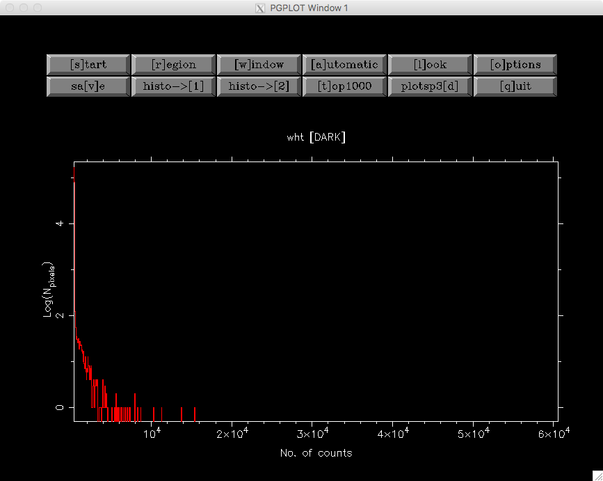

Option ``histo-->[2]`` in main menu
...................................

This option computes a histogram of pixel values deviations with respect to the
local mean (computed using the signal from neighbour pixels), in units of the
local standard deviation.

::

   Enter region to be used to calculate histogram:
   1st and last scan [1,226] ? 
   1st and last channel [1,1124] ? 
   Wait...  ..OK!
   Minimum value [-271.445862] ? 
   Maximum value [1680.80664] ? 
   No. of bins  (1,...,1000) [1000] ? 
   Replot (y/n) [n] ? 

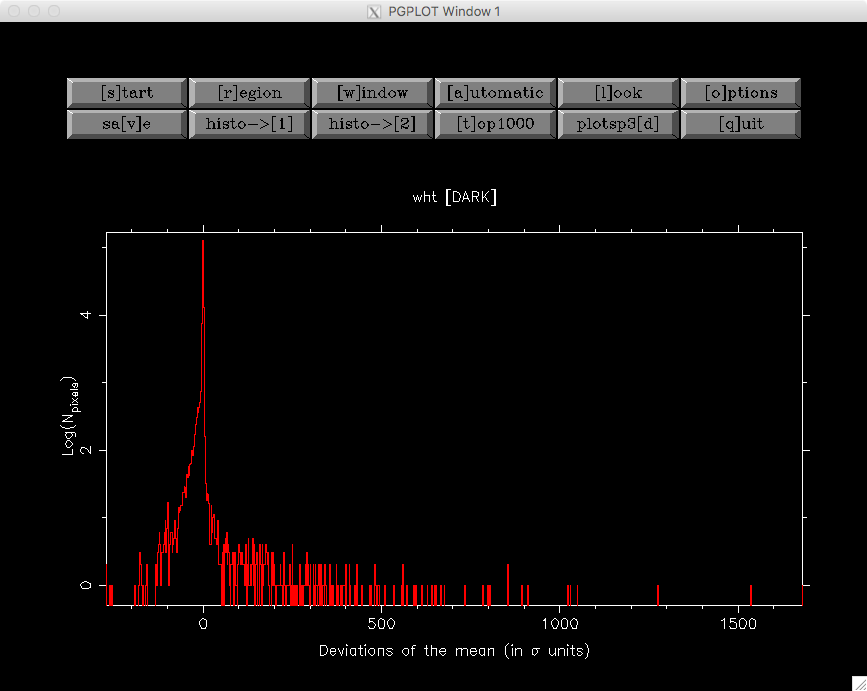

Option ``[t]op1000`` in main menu
.................................

This option computes a histogram of pixel values deviations with respect to the
local mean (computed using the signal from neighbour pixels), in units of the
local standard deviation, sorts the pixels according to these values, and
allows the user to remove, interactively, up to the 1000 *brightest* cosmic ray
hits.

::

   Enter region to be used to calculate top 1000:
   1st and last scan [1,226] ? 
   1st and last channel [1,1124] ? 
   Wait...  ..OK!
   Sorting... ..OK
   Minimum value [-271.445862] ? 
   Maximum value [1680.80664] ? 
   No. of bins  (1,...,1000) [1000] ? 
   NOTE: the dashed green-line indicates the TOP1000 level
   Replot (y/n) [n] ?

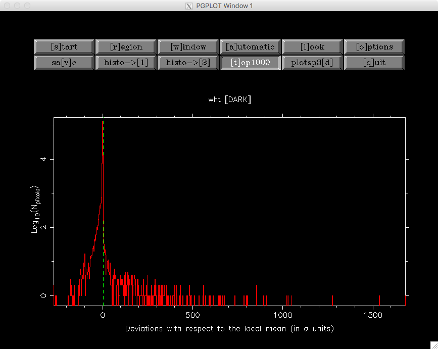

Option ``plotsp3[d]`` in main menu
..................................

This option displays rectangular image regions simulating a 3D representation.
It is no longer very useful, but it has not been removed for historical
reasons.

::

   1st & last channel [1,1124] ? 1,100
   1st & last scan    [1,226] ? 

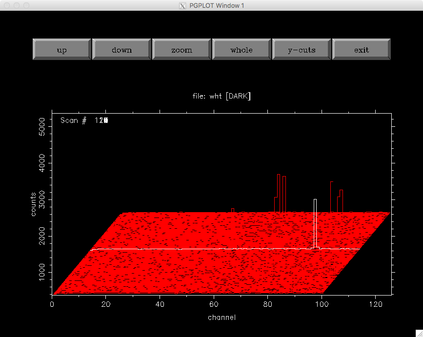

Option ``[q]uit`` in main menu
..............................

This button stops the program execution. If the image has been modified since
the last time it was saved, the program warns the user about this fact and asks
for confirmation.

::

   WARNING: last changes have not been saved.
   Do you really want to QUIT (y/n) [n] ? 

Otherwise, the program stops quietly.

